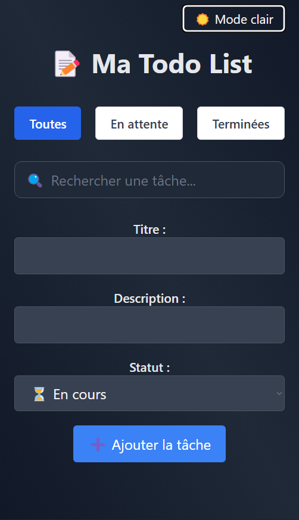
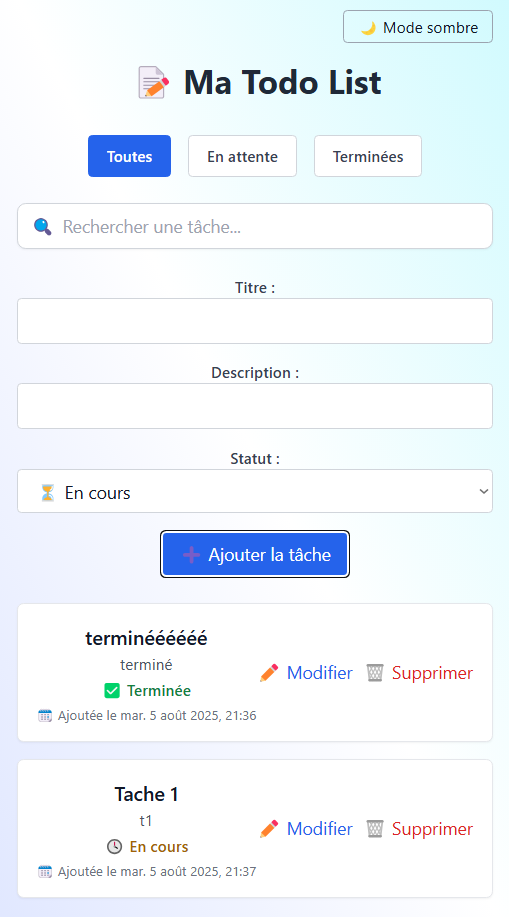

# 📝 Todo App

Une application de gestion de tâches (frontend en Vue.js + backend en Symfony API).  
Projet vitrine pour m'exercer et présenter mon travail.

## 🛠️ Techno utilisées
- Frontend : Vue 3 + Tailwind CSS
- Backend : Symfony (API Platform)

  
  

